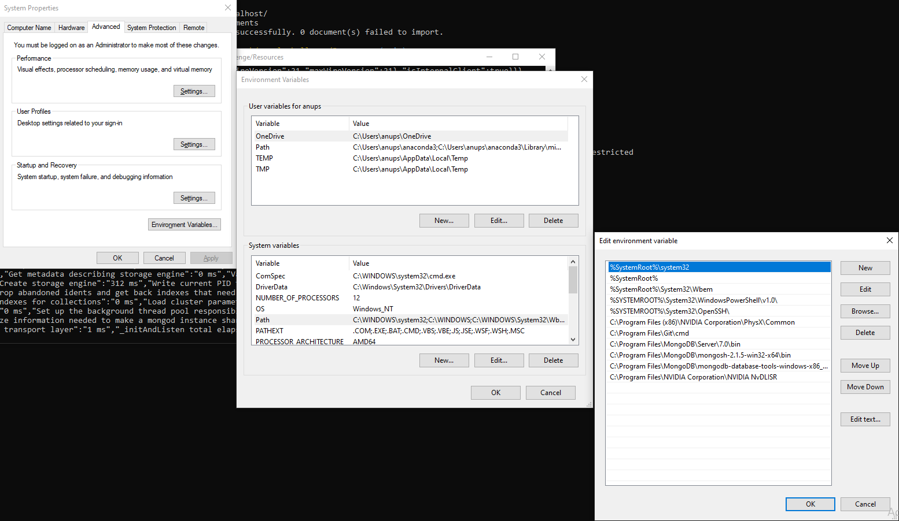

# nosql-challenge
Module 12 Challenge - Robertson, J - NoSQL Databases, MongoDB, PyMongo
---
## Getting started

An anaconda dev environment with python version 3.7 was used to edit the notebook file and perform all operations.

The two methods used to edit code were:

  1. VSCode with the Jupyter extension (ms-toolsai.jupyter) & Python extension(ms-python.python).
  
  2. A Jupyter Lab IDE session started with the following command line through git terminal:
   
    jupyter jab

The PyMongo package was used to run commands through the git terminal in a dev environment. To install PyMongo run: 
    
    conda install pymongo 
or 

    pip install pymongo

MongoDB has been used to handle the file types as database objects. To install MongoDB go to:

    https://www.mongodb.com/try/download/community

Download and instal version 7.0.x, ensuring to select MongoDB Compass as part of the installation.

Two database tools were downloaded and installed, MongoDB Shell & MongoDB Command Line Database Tools:

    https://www.mongodb.com/try/download/shell
    
    https://www.mongodb.com/try/download/database-tools

Extract the folders to your local installation folder of your MongoDB:

We need to add the 'bin' folder for MongoDB and the database tools into your environment path variables:

Create a folder named 'data' containing a folder names 'db' in the root directory your MongoDB is installed:

Now you should be good to go!

---

## Summary of code

Initialize a local db session through your git terminal by running:
    
    mongod

In a new terminal window we can import the 'establishments.json' object as a database object with the following line:

    mongoimport "C:\Users\anups\Desktop\Data\Analytics\Homework\nosql-challenge\Resources\establishments.json" -d uk_food -c establishments --jsonArray --drop

Replace the folder location of the json file with the location installed on your local machine. We've named the database 'uk_food' and called the collection 'establishments.'

We can check the success of the import by running:

    mongosh
    show dbs
    use uk_food
    show collections
    db.establishments.find()

This will return a few database objects in our 'establishments' collection.

---

## References
--- 

---

