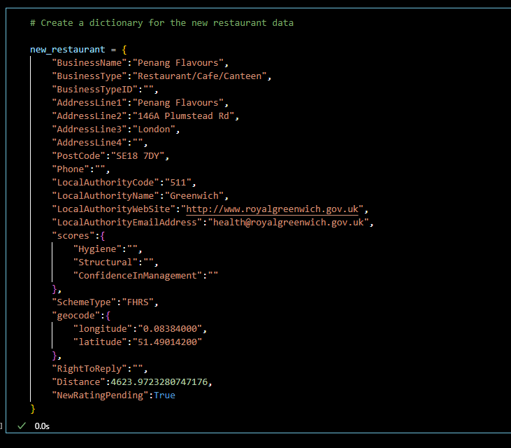
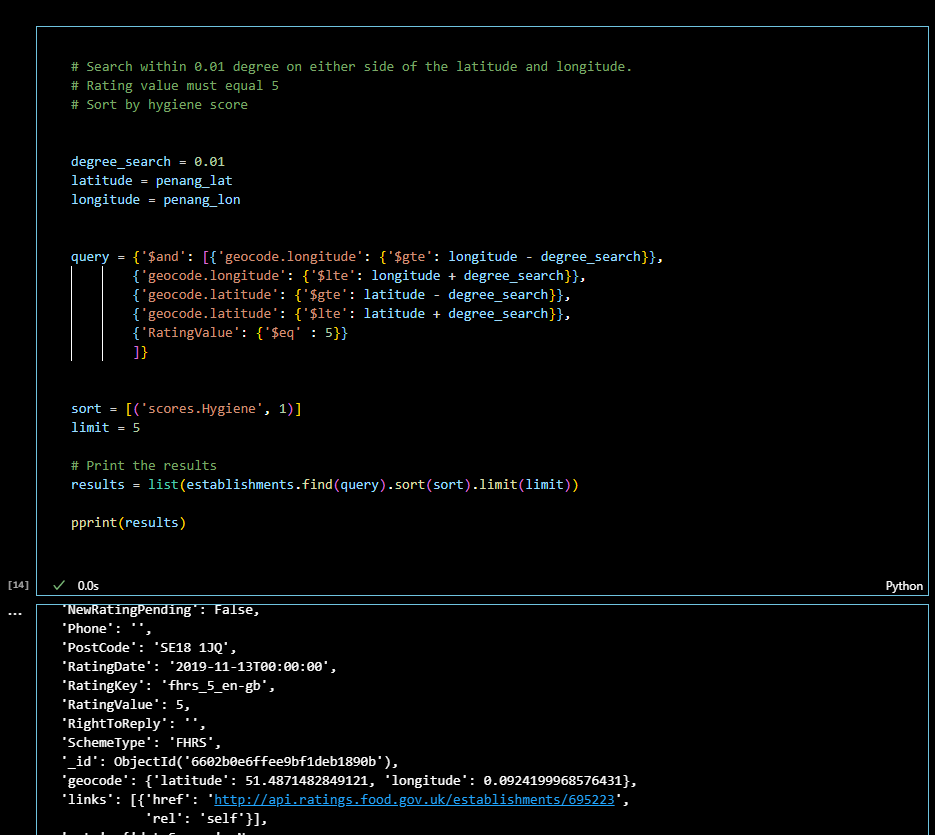

# nosql-challenge
Module 12 Challenge - Robertson, J - NoSQL Databases, MongoDB, PyMongo
---
## Getting started

An anaconda dev environment with python version 3.7 was used to edit the notebook file and perform all operations.

The two methods used to edit code were:

  1. VSCode with the Jupyter extension (ms-toolsai.jupyter) & Python extension(ms-python.python).
  
  2. A Jupyter Lab IDE session started with the following command line through git terminal:
   
    jupyter jab

The PyMongo package was used to run commands through the git terminal in a dev environment. To install PyMongo run: 
    
    conda install pymongo 
or 

    pip install pymongo

MongoDB has been used to handle the file types as database objects. To install MongoDB go to:

    https://www.mongodb.com/try/download/community

Download and instal version 7.0.x, ensuring to select MongoDB Compass as part of the installation.

Two database tools were downloaded and installed, MongoDB Shell & MongoDB Command Line Database Tools:

    https://www.mongodb.com/try/download/shell
    
    https://www.mongodb.com/try/download/database-tools

Extract the folders to your local installation folder of your MongoDB:

We need to add the 'bin' folder for MongoDB and the database tools into your environment path variables:

Create a folder named 'data' containing a folder names 'db' in the root directory your MongoDB is installed:

Now you should be good to go!

---

## Summary of code

Initialize a local db session through your git terminal by running:
    
    mongod

We can import the 'establishments.json' object as a database object by opening a new git terminal in the 'nosql-challenge' local github directory and running the following line:

    mongoimport "Resources\establishments.json" -d uk_food -c establishments --jsonArray --drop

Replace the folder location of the json file with the location installed on your local machine. We've named the database 'uk_food' and called the collection 'establishments.'

We can check the success of the import by running:

    mongosh
    show dbs
    use uk_food
    show collections
    db.establishments.find()

This will return a few database objects in our 'establishments' collection.

### Part 1: Database and Jupyter Notebook Set Up

Using your notebook file edit method of choice install the following pythong libraries:

    from pymongo import MongoClient
    from pprint import pprint
    import pandas as pd

Create a new mongo instance to connect to our database. From here we can check our collection and preview one object so inspect the types of information:

### Part 2: Update the Database

Assign a varialbe to a dictionary to store the new restaurant data:

Using another database isntance of the restaurant type we can find the 'businesstype' and 'businesstypeid' and create a dictionary to store this information and add it into the new restaurant data:

We can omit any objects with 'Dover' in the 'LocalAuthorityName' by creating a query selecting that criteria. From there we can parse this query through the 'delete_many' operation to remove all these objects:

To maintain data integrity we need to convert some datatypes into decimal or integer values. We can use the 'update_many' operation to achieve this:

### Part 3: Exploratory Analysis

Using MongoDB Query Selectors, both Comparison and Logical we can slice our information to filter it by certain criteria. We can further sort our information using the equivalent of Pandas groupby function to keep count and group by certain fields:

---

## References
--- 

1. www.youtube.com. (n.d.). Complete MongoDB Tutorial #10 - Operators & Complex Queries. [online] Available at: https://www.youtube.com/watch?v=NRKGZdJTf48 [Accessed 26 Mar. 2024].‌

2. chat.openai.com. (n.d.). ChatGPT. [online] Available at: https://chat.openai.com/share/c1ea295b-112d-4ddf-9aa0-e9b0e8d1d6b4 [Accessed 26 Mar. 2024].

‌

---

